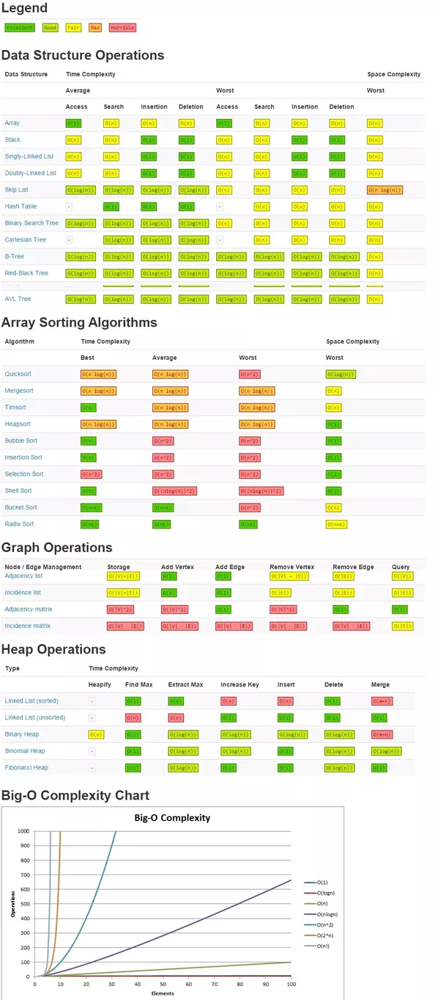

# Big-O Notation

#### O(1) -> O(log(n)) -> O(n) -> O(n log(n)) -> O(n^2) -> O(2^n) -> O(n!)



## O(1)
 * constant time
 * amount of input does not affect the runtime/space complexity 

## O(log(n))
  * logarithmic time - inverse of exponential 
  * each iteration removes some possibilities
    * thus, each iteration gets faster because there is less data to iterate over
  * ex. binary tree
  * for each element you inspect, you can discard half of the results
    * ex. binary search tree
  * `log(n) = time` ~ is the same as ~ `base^time = n`
    * ex. `log2(64) = 6` ... `2^6 = 64`
  ```
  for (i = 0; i < n; i *= 2) {
    do_something
  }
  ```
  * the rate at which n is reached is cut down by `i *= 2`
  * skipping iterations by a factor of `2x`

## O(n)
  * linear time
  * as the input increase/decreases, so does the runtime
  * ex. looping over some data
  ```
  const func = arr => {
    return arr.map(element => { ... })
  }
  ```
  #### O(100n) -> O(n)
  ```
  for (i = 0; i < n; i++) {
    for (j = 0; j < 100; j++) {
      do_something
    }
  }
  ```
  * this would be `O(n^2)` if `j` was dependant on `n`

## O(n log(n))
  * ex. merge sort and quick sort
  * `n` because we iterate over the entire array
  * `log(n)` because each successive recursive call is splitting the inputs 
  * you iterate `n` times, and for each iteration, you do an extra task that gets more efficient each time `log(n)`
  ```
  const quicksort = arr => {
    const pivot = arr.pop();
    return [
      quicksort(arr.filter(i => i < pivot)),
      pivot,
      quicksort(arr.filter(i => i > pivot))
    ]
  }
  ```

## O(n^2)
  * quadratic time
  * ex. a loop within a loop - nested loop
  * each iteration requires another set of the same amount of iterations
  ```
  const func = somedata => {
    somedata.forEach(element => {
      element.forEach(value => { ... })
    })
  }
  ```

## O(n^3)
  ```
  while (some_value < n * n * n) {
    do_something
  }
  ```

## O(2^n)
  * each iteration spawns at least one more than the last
  * ex. recursive algos
  ```
  const fib = num => {
    if (num === 0 || num === 1) return num;
    return fib(num - 1) + fib(num - 2);
  }
  ```

